A basic colorpicker control made in Qt Quick/QML, as described in [the corresponding blog post](http://blog.ruslans.com/2010/12/cute-quick-colorpicker.html).

# Prerequisite
- Qt6(Qml, Quick and QuickControls2)
- It's also needed c++ compiler env, Qt6 Core and Qt6 Gui to run test.
- Note : If you want to use this on Qt5, refer to the other branch.

# How to test
see test directory and below gallery.

# New features
- Layout calculation using DPM(Pixel/Dot Per Millimeter) of primary screen.
- Fontsize calculation using Qt Window info(optional).
- Mostly follow [QML themes and styles](https://doc.qt.io/qt-6/qtquickcontrols2-styles.html).
- Support changing almost every layout parameters at runtime.

# Gallery
## Qt 6.4.3, windows (windows10)
### Basic Style
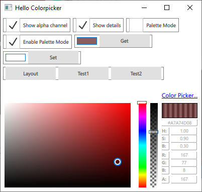

### Basic Style and fake low DotPerMilimeter
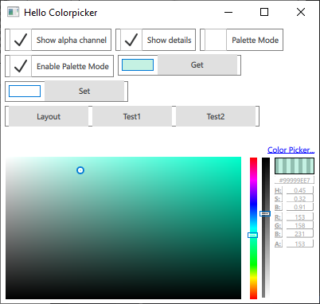

### Basic Style and Palette mode

### Universal Style and fake low DotPerMilimeter
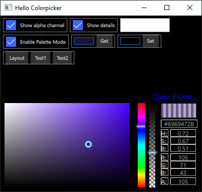

### Imagine Style, portrait and fake low DotPerMilimeter
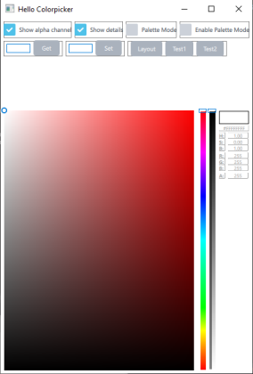

### Material Style and fake low DotPerMilimeter
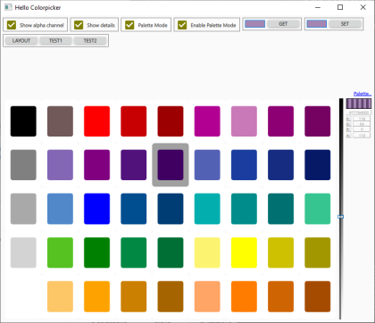

## Qt 6.4.3, android (Pixel 6 Pro API 33 on Simulator)
### Basic Style
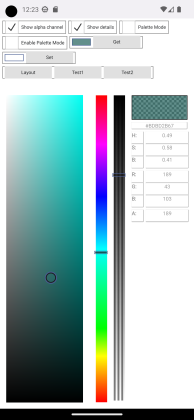

### Basic Style, palette mode and fake low DotPerMilimeter
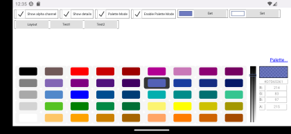

### Basic Style, palette mode and fake low DotPerMilimeter(alternative font size calculation)
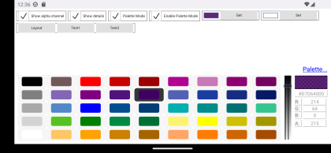

## Qt 6.4.3, linux (ubuntu 22.04.2 LTS on Hyper-V)
### Basic Style
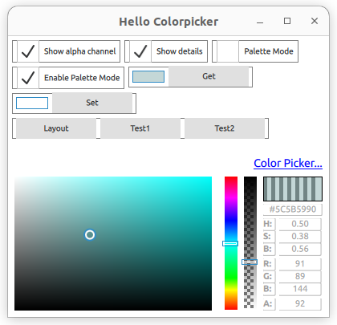

## Qt6.4.3, iPhone 14 pro (iOS16.2 on Simulator)
### Basic Style and fake low DotPerMilimeter
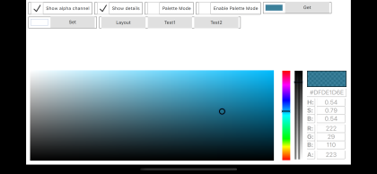

### Basic Style and portrait
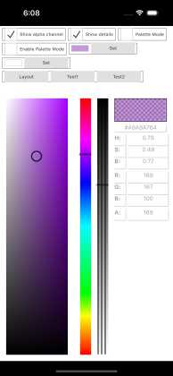

### Basic Style, palette mode and fake low DotPerMilimeter
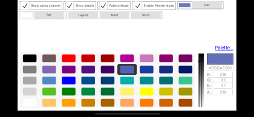
