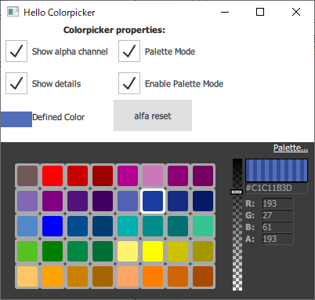
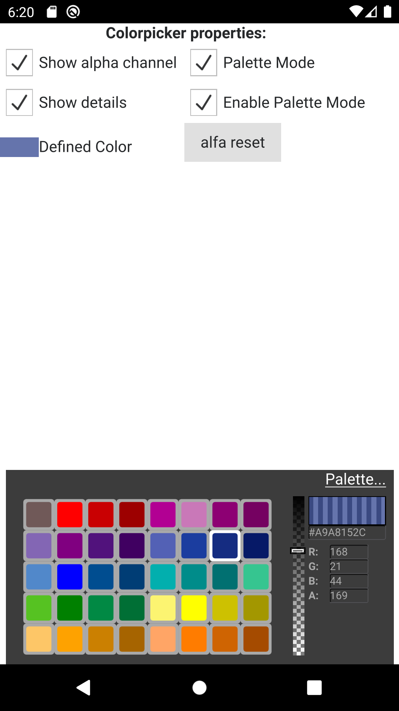
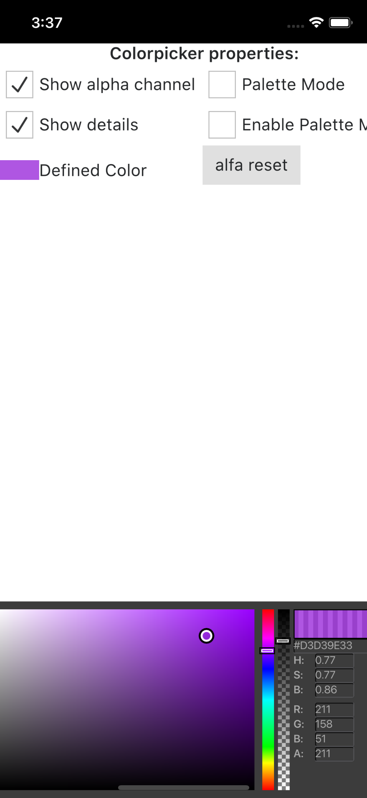
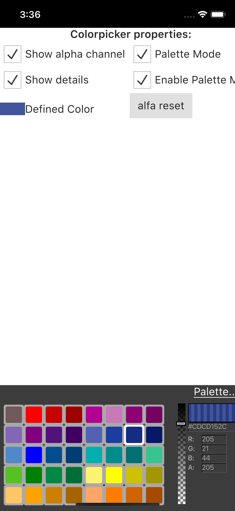

Colorpicker
------------
A basic colorpicker control made in Qt Quick/QML, as described in [the corresponding blog post](http://blog.ruslans.com/2010/12/cute-quick-colorpicker.html).

## Qt 5.11.3 + windows 10

## Qt 5.14.1 + android 10.0(API 29)

## Qt 5.11.1 + ios2 simulator

